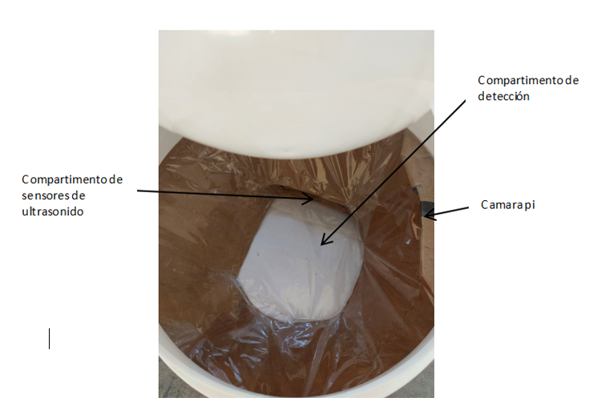
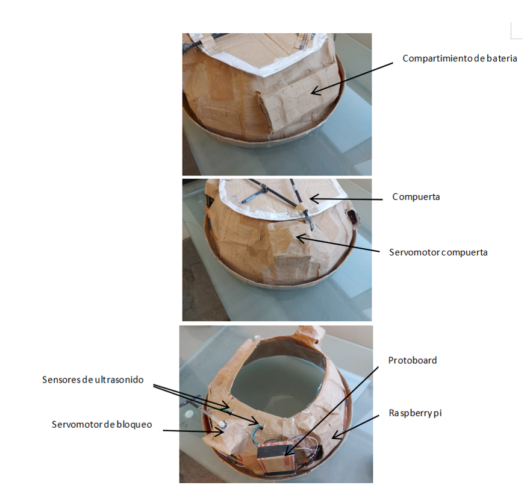
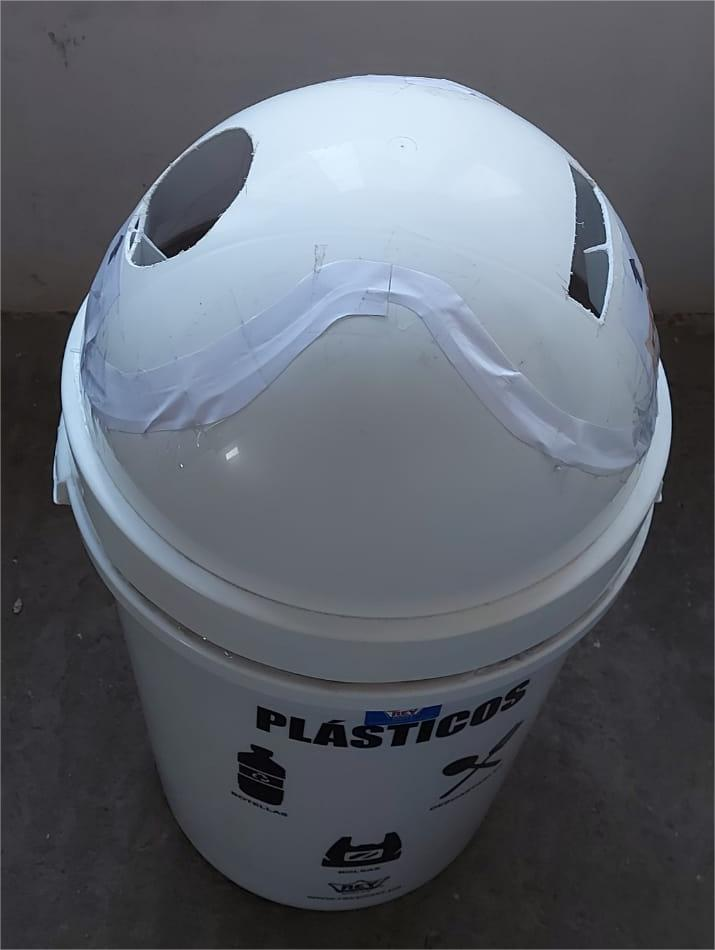

# Prototype Food Octagons

## About the Prototype

**Prototype Food Octagons** is an innovative solution designed to recognize and process packaging of processed foods with octagons. This prototype, controlled by a Raspberry Pi, aims to enhance waste management by identifying specific food packages, capturing images, and uploading data to Firebase for future dataset expansion and reporting.

## Features

- **Identification of Food Packages**: Currently identifies 10 types of processed food packages with octagons.
- **Image Capture**: Takes images of the waste entering the prototype using the Pi camera and uploads them to Firebase.
- **Ultrasonic Sensors**: Detects items falling into the prototype for processing.
- **Servo Motors**: Operate a gate to dispose of processed items into the trash can.
- **Data Upload**: Sends recognized package data to Firebase for report generation and display in the associated app.
- **Smart Trash Can Control**: Integrates with the smart trash can to manage the disposal process.

### Screenshots

*Detection Compartment Installed in Trash Can*

*Prototype Compartments*

*Prototype Installed in Trash Can*

## Architecture

The prototype's architecture follows modular design principles to ensure scalability and maintainability. The key modules are:

- **Components Module**: Contains all components used in the project.
- **Communication Module**: Handles uploading information generated by the prototype to Firebase.
- **Identification Module**: Responsible for identifying processed food packages with octagons.
- **Config File (config.py)**: Contains all project configuration variables such as GPIO pins, servo motor frequencies, model paths, Firebase credentials, etc.
- **Main File (main.py)**: The primary file that integrates all components and executes the prototype.
- **Servo Controller File (servo_controller.py)**: Contains the `ServoController` class for specific control of the prototype's servomotors.
- **Utils File (utils.py)**: Includes support functions invoked in project libraries, such as generating unique file names.
- **Server Folder**: Contains `server.py`, the local server file for controlling the prototype via the app.

## Electronic Components

1. **Ultrasonic Sensors HC-SR04**:
   - **Quantity**: 2
   - **Function**: Detect objects falling into the detection compartment.
2. **Pi Camera**:
   - **Function**: Capture images of objects entering the detection compartment.
3. **Servomotors SG90**:
   - **Quantity**: 2
   - **Functions**: One opens and closes the detection compartment gate, the other secures the gate to prevent accidental opening.
4. **Raspberry Pi 4B**:
   - **Function**: Manages all component logic and executes object detection model inferences.
5. **Power Bank**:
   - **Capacity**: 10,000 mAh
   - **Power**: 22.5W
   - **Function**: Power source for the prototype.
6. **USB to USB-C Cable**:
   - **Function**: Connects the power bank to the Raspberry Pi.
7. **Micro SD Card**:
   - **Function**: Stores the Raspberry Pi operating system.
8. **Male and Female Cables**:
   - **Function**: Connect electronic components to the Raspberry Pi GPIO pins.
9. **Small Breadboard**:
   - **Function**: Mounts a circuit for the ultrasonic sensors.
10. **Resistors (330 and 470 Ohms)**:
   - **Function**: Used in the ultrasonic sensor circuit.
