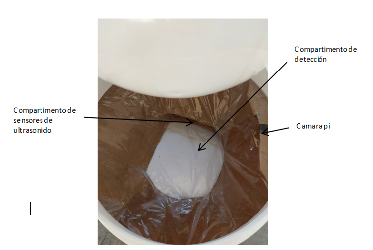
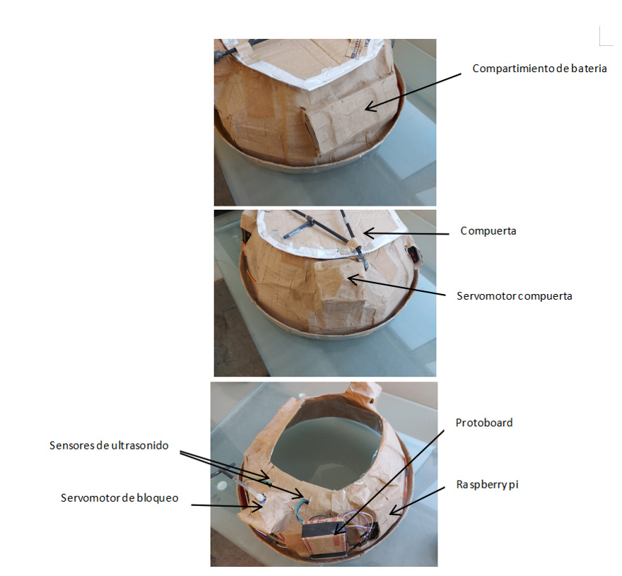
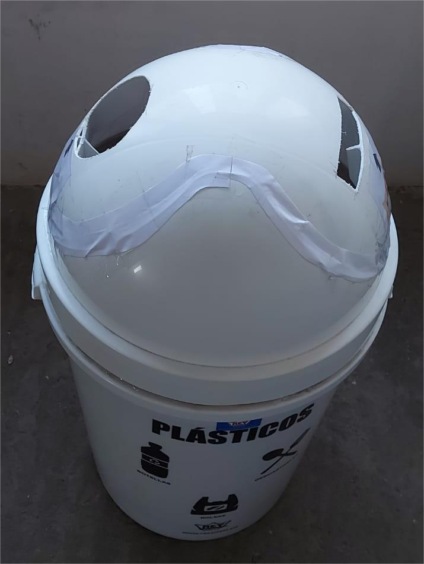

# 🥫 Prototipo de Octágonos Alimenticios

## 📌 Acerca del Prototipo

**Prototipo de Octágonos Alimenticios** es una solución innovadora diseñada para **reconocer y procesar empaques de alimentos procesados con octágonos**.  

Este prototipo, controlado por una **Raspberry Pi**, busca mejorar la **gestión de residuos** al:  
- Identificar empaques específicos de alimentos.  
- Capturar imágenes.  
- Subir datos a **Firebase** para la expansión de datasets y la generación de reportes.  

---

## ✨ Características

- 🔍 **Identificación de Empaques**: Reconoce 10 tipos de empaques de alimentos procesados con octágonos.  
- 📸 **Captura de Imágenes**: Toma fotos con la cámara de la Raspberry Pi y las sube automáticamente a Firebase.  
- 📡 **Sensores Ultrasónicos**: Detectan los objetos que caen en el compartimento de detección.  
- ⚙️ **Servomotores**: Manejan la compuerta para desechar los objetos procesados en el basurero.  
- ☁️ **Carga de Datos**: Sube la información de los empaques reconocidos a Firebase para generar reportes y mostrarla en la app asociada.  
- 🗑️ **Integración con Basurero Inteligente**: Controla el proceso de disposición final de residuos.  

---

## 🏗️ Arquitectura del Proyecto

La arquitectura sigue un **diseño modular** para asegurar **escalabilidad y mantenibilidad**.  

- 📦 **Módulo de Componentes** → Contiene todos los componentes del proyecto.  
- 🔗 **Módulo de Comunicación** → Sube información generada a Firebase.  
- 🧠 **Módulo de Identificación** → Reconoce empaques procesados con octágonos.  
- ⚙️ **Archivo de Configuración (config.py)** → Variables del proyecto: pines GPIO, servomotores, rutas de modelos, credenciales de Firebase, etc.  
- ▶️ **Archivo Principal (main.py)** → Integra todos los componentes y ejecuta el prototipo.  
- 🕹️ **Controlador de Servos (servo_controller.py)** → Clase `ServoController` para manejar servomotores.  
- 🛠️ **Archivo de Utilidades (utils.py)** → Funciones de apoyo (ej. generar nombres únicos).  
- 🌐 **Carpeta Server** → Contiene `server.py`, servidor local para control desde la app.  

---

## 🔌 Componentes Electrónicos

1. **Sensores Ultrasónicos HC-SR04**  
   - Cantidad: 2  
   - Función: Detectan objetos que caen en el compartimento de detección.  

2. **Cámara Pi**  
   - Función: Captura imágenes de los objetos que ingresan al compartimento.  

3. **Servomotores SG90**  
   - Cantidad: 2  
   - Funciones:  
     - Abrir/cerrar la compuerta de detección.  
     - Asegurar la compuerta para evitar aperturas accidentales.  

4. **Raspberry Pi 4B**  
   - Función: Gestiona la lógica de los componentes y ejecuta las inferencias del modelo de detección.  

5. **Power Bank**  
   - Capacidad: 10,000 mAh  
   - Potencia: 22.5W  
   - Función: Fuente de energía del prototipo.  

6. **Cable USB a USB-C**  
   - Función: Conectar el power bank a la Raspberry Pi.  

7. **Tarjeta Micro SD**  
   - Función: Almacena el sistema operativo de la Raspberry Pi.  

8. **Cables Macho y Hembra**  
   - Función: Conectar componentes electrónicos a los pines GPIO.  

9. **Mini Protoboard**  
   - Función: Montar el circuito para los sensores ultrasónicos.  

10. **Resistencias (330 y 470 Ohmios)**  
   - Función: Usadas en el circuito de los sensores ultrasónicos.  

---

## 🖼️ Capturas de Pantalla

  
*Compartimento de detección instalado en el basurero*  

  
*Compartimentos del prototipo*  

  
*Prototipo instalado en el basurero*  

🎥 [Ver video demo](https://vimeo.com/1016898002)

---

📌 Proyecto desarrollado en **Python** con integración de hardware y servicios en la nube.  

---
